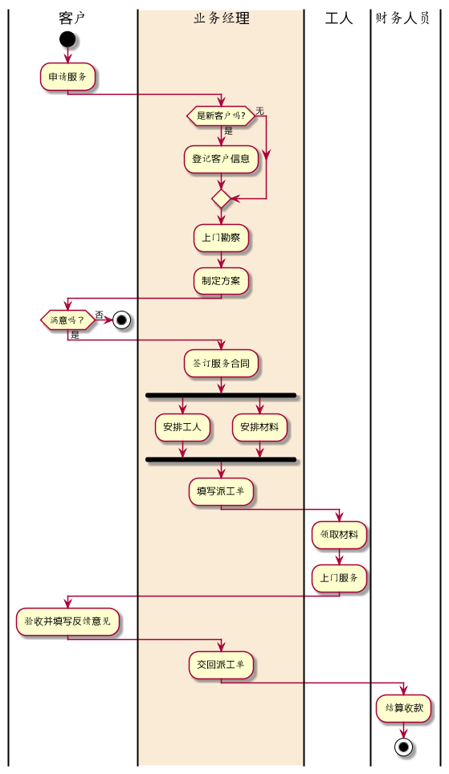

# 实验1：业务流程建模
|学号|班级|姓名|照片|
|:-------:|:-------------: | :----------:|:---:|
|201710414202|软件(本)17-2|陈琰||
## 流程图1：考试及成绩管理流程

**PlantUML源码如下：**

``` flow1
@startuml
|客户|
start
:申请服务;
|#AntiqueWhite|业务经理|
if (是新客户吗?) then(是)
    :登记客户信息;
else(无)
endif
:上门勘察;
:制定方案;
|客户|
if (满意吗？) then(否)
    stop
else(是)
    |业务经理|
    :签订服务合同;
    fork
        :安排工人;
    fork again
        :安排材料;
    fork end
    :填写派工单;
    |工人|
    :领取材料;
    :上门服务;
    |客户|
    :验收并填写反馈意见;
    |业务经理|
    :交回派工单;
    |财务人员|
    :结算收款;
    stop
@enduml
```

**业务流程图如下：**
png


**流程说明：**

用户为客户,客户可以与业务经理直接沟通。
相关业务有登记用户信息，上门勘察，制定方案;
工人和业务经理直接沟通，相关业务有领取材料，上门服务；
财务人员和业务经理直接沟通，相关业务有结算收款；
