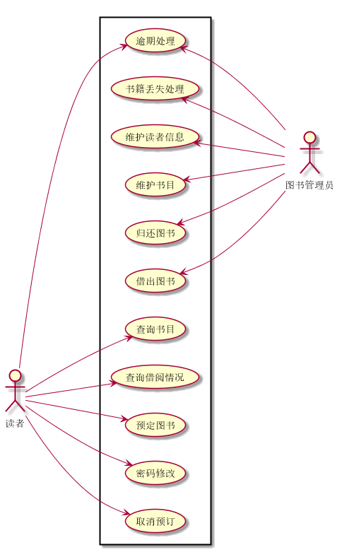

# 实验2：图书管理系统用例建模
|学号|班级|姓名|照片|
|:-------:|:-------------: | :----------:|:---:|
|201710414202|软件(本)17-2|陈琰||
## 1. 图书管理系统的用例关系图

### 1.1 用例图PlantUML源码如下：

``` usecase
@startuml
left to right direction
actor 图书管理员
actor 读者
rectangle  {
  图书管理员 -up--> (借出图书)
  图书管理员 -up-> (归还图书)
  图书管理员 -up-> (维护书目)
  图书管理员 -up-> (维护读者信息)
  图书管理员 -up->(书籍丢失处理)
  图书管理员 -up->(逾期处理)
  读者 -down--> (查询书目)
  读者 -down-> (查询借阅情况)
  读者 -down-> (预定图书)
  读者 -down-> (逾期处理)
  读者 -down-> (密码修改)
  读者 -down-> (取消预订)
}
@enduml
```


### 1.2. 用例图如下：

参见图7.6



## 2. 参与者说明：

**2.1图书管理员**

主要职责是：对图书进行维护管理，处理归还的图书，登记借出的图书，管理用户信息，修改密码，读者图书逾期处理，书籍丢失处理。

**2.2读者**

主要职责是：浏览图书信息，查询已借阅图书，登记借书信息，预定和取消预定图书，归还图书，借书逾期处理，书籍丢失处理，密码修改。

## 3.用例规约表
**3.1“借出图书”用例**
|用例名称|借书|
|--|--|
|参与者|读者|
|前置条件|读者登陆图书管理系统，提出要借的书名，图书管理员查找到该书还有库存|
|主事件流|
|参与者动作|系统行为|
|1.图书管理员选择“借阅登记”，提交“借阅登记”请求；3.读者输入借阅登记信息。|2.系统提示“借阅登记”空白窗口；4.系统列表显示出该读者在借图书信息和该读者借阅期限的权限；若借书者输入借阅登记非法，进入4.1，若借书者所需书籍不存在，进入4.2，若书籍数量不足，进入4.3|
|异常事件流|
|参与者动作|系统行为|
|4.1登记不合法4.2未填写登记信息4.3图书馆未收录该书籍4.4书籍数量不足|4.1提示用户重新输入4.2提示用户登记信息4.3提示用户预订购买图书4.4提示用户预订借阅图书|
|后置条件|用户借书成功|

**3.2“购入图书”用例**
|用例名称|编目|
|--|--|
|参与者|采编员|
|前置条件|登陆图书管理系统|
|后置条件|产生新的编目并存储|
|主事件流|
|参与者动作|系统行为|
|2.采编员输入书籍名字、编码、存放地址、数量、存放时间；4.采编员确认保存结果；|1.系统显示所有在编目中需要输入的输入项并给出输入框；3.系统确认输入信息、保存并返回保存结果；5.系统回到首页，用例结束。|
|备选事件流|
|3a.没有输入书籍名1.系统提示没有输入名字，用例结束3b.没有输入编码或编码格式错误1.系统提示没有输入编码或编码错误，用例结束3c.没有输入数量1.系统提示没有输入数量，用例结束3e.没有输入存放时间1.系统提示没有输入存放时间，用例结束。|
|业务规约|
|1.每个编码必须唯一且未被使用；2.数量必须大于0；3.存放时间必须只能当天或未来某个时间；4.如果采编员没有确认保存结果，系统需要删除刚刚保存的内容。|

**“购入图书”用例流程图源码如下：**
```
@startuml
start
:系统管理员;
:打印采集书籍信息;
->把采集单给采编员;
:采编员;
->根据采集单购买书籍;
:系统管理员;
end
@enduml
```
**“购入图书”用例流程图如下：**

