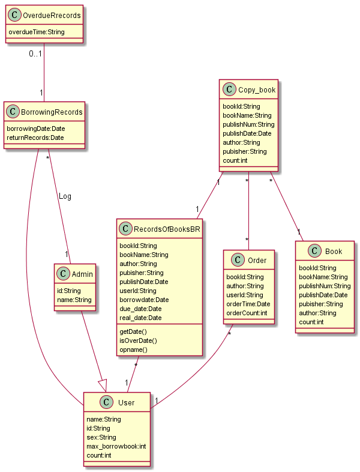
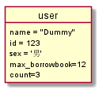

# 实验3：图书管理系统领域对象建模（老师示范）
|学号|班级|姓名|照片|
|:-------:|:-------------: | :----------:|:---:|
|201710414202|软件(本)17-2|陈琰||

## 1. 图书管理系统的类图

### 1.1 类图PlantUML源码如下：

``` @startuml 
User :  name:String
User :  id:String
User :  sex:String
User :  max_borrowbook:int
User :  count:int
BorrowingRecords-- User
BorrowingRecords : borrowingDate:Date
BorrowingRecords : returnRecords:Date
OverdueRrecords"0..1"--"1"BorrowingRecords
OverdueRrecords : overdueTime:String
BorrowingRecords"*"--"1"Admin : "Log"
Admin--|>User
Admin : id:String
Admin : name:String
RecordsOfBooksBR"*"--"1"User
RecordsOfBooksBR : bookId:String
RecordsOfBooksBR : bookName:String
RecordsOfBooksBR : author:String
RecordsOfBooksBR : pubisher:String
RecordsOfBooksBR : publishDate:Date
RecordsOfBooksBR : userId:String
RecordsOfBooksBR : borrowdate:Date
RecordsOfBooksBR : due_date:Date
RecordsOfBooksBR : real_date:Date
RecordsOfBooksBR : getDate()
RecordsOfBooksBR : isOverDate()
RecordsOfBooksBR : opname()
Order"*"--"1"User
Order : bookId:String
Order : author:String
Order : userId:String
Order : orderTime:Date
Order : orderCount:int
Copy_book"*"--"*"Order
Copy_book : bookId:String
Copy_book : bookName:String
Copy_book : publishNum:String
Copy_book : publishDate:Date
Copy_book : author:String
Copy_book : pubisher:String
Copy_book : count:int
Copy_book"1"--"1"RecordsOfBooksBR
Copy_book"*"--"1"Book
Book : bookId:String
Book : bookName:String
Book : publishNum:String
Book : publishDate:Date
Book : pubisher:String
Book : author:String
Book : count:int
@enduml
```

### 1.2. 类图如下：



### 1.3. 类图说明：
Admin:管理员类

User类:
用户 :  name:String //姓名
用户 :  ID:String //id
用户 :  Sex:char  //性别
用户 :  Max_borrowbook:int //最大借阅数
用户 :  count:int   //借阅次数

借还书记录:RecordsOfBooksBR
RecordsOfBooksBR : bookId:String //书号
RecordsOfBooksBR : bookName:String //书名
RecordsOfBooksBR : author:String //作者
RecordsOfBooksBR : pubisher:String //出版社名
RecordsOfBooksBR : publishDate:Date //出版社名
RecordsOfBooksBR : userId:String //用户ID
RecordsOfBooksBR : borrowdate:Date //出版日期
RecordsOfBooksBR : due_date:Date //预计归还
RecordsOfBooksBR : real_date:Date //实际归回时间
RecordsOfBooksBR : getDate() //获取日期
RecordsOfBooksBR : isOverDate() //是否超时

Order:预约
Order : bookId:String //book的id
Order : author:String //作者
Order : userId:String //读者ID
Order : orderTime:Date //预约时间
Order : orderCount:int //预约数量

Book:书
Book : bookId:String //书号
Book : bookName:String //书名
Book : publishNum:String //出版号
Book : publishDate:Date //出版日期
Book : pubisher:String //出版社名
Book : author:String //作者
Book : count:int //数量

主要的人员有用户和管理员，关系有借还书，预约等。
管理员主要负责登记用户的各种信息。
用户可以在系统上进行预约和借书等操作。
## 2. 图书管理系统的对象图
### 2.1 类user的对象图
#### 源码如下：
``` class
@startuml
object user {
name = "Dummy"
id = 123
sex = '男'
max_borrowbook=12
count=3
}
@enduml
``` 
#### 对象图如下：

