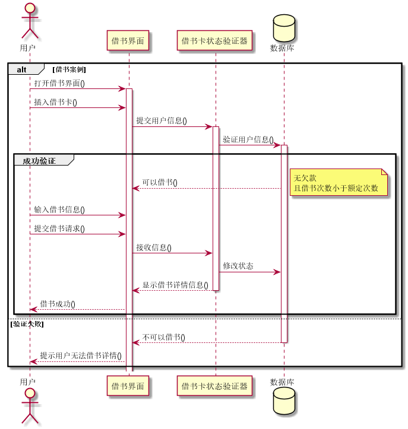
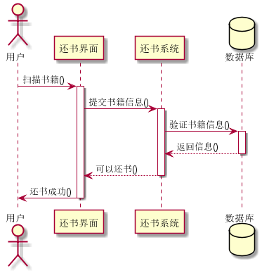

# 实验4：图书管理系统顺序图绘制
|学号|班级|姓名|照片|
|:-------:|:-------------: | :----------:|:---:|
|201710414202|软件(本)17-2|陈琰||

## 图书管理系统的顺序图

## 1. 借书用例
## 1.1. 借书用例PlantUML源码

``` 
@startuml
actor 用户
  participant "借书界面" as A
  participant "借书卡状态验证器" as B
  database "数据库"  as C

 alt 借书案例
 用户 -> A: 打开借书界面()
 activate A
 用户 -> A: 插入借书卡()
 A -> B: 提交用户信息()
 activate B
 B -> C: 验证用户信息()
 activate C
 group 成功验证
 C --> A: 可以借书()
 note right:无欠款\n且借书次数小于额定次数
 用户 -> A: 输入借书信息()
 用户 -> A: 提交借书请求()
 A -> B:接收信息()
 B -> C: 修改状态

 B --> A: 显示借书详情信息()
 deactivate B
 A --> 用户: 借书成功()
 deactivate 用户
 end
 else 验证失败
 C --> A: 不可以借书()
 deactivate C
 A --> 用户: 提示用户无法借书详情()
 end
@enduml
```

## 1.2. 借书用例顺序图


## 1.3. 借书用例顺序图说明
借书用例:
分为成功用例和失败用例
  a.成功用例:
  打开借书界面，插入借书卡->借书卡验证->数据库获取信息验证是否有欠款，是否借书次数小于额定次数，如果是返回可以借书
  用户得到可以借书，可以提交申请，数据库更改信息，返回成功借书
  b.失败用例:
  打开借书界面，插入借书卡->借书卡验证->数据库获取信息验证是否有欠款，是否借书次数小于额定次数，如果否返回不可以借书
  用户得到不可以借书，不可以提交申请
***

## 2. 还书用例
## 2.1. 还书用例PlantUML源码

``` sequence
@startuml
actor 用户
  participant "还书界面" as A
  participant "还书系统" as B
  database "数据库"  as C

 用户 -> A: 扫描书籍()
 activate A
 A -> B: 提交书籍信息()
 activate B
 B -> C: 验证书籍信息()
 activate C
 C --> B: 返回信息()
 deactivate C
 B --> A: 可以还书()
 deactivate B
 A -> 用户: 还书成功()
 deactivate A

@enduml
```

## 2.2. 还书用例顺序图


## 2.3. 还书用例顺序图说明
还书用例:
  用户在扫描机器上扫描，或者输入信息，还书系统验证书籍信息，录入系统，返回信息，提示用户还书成功。
